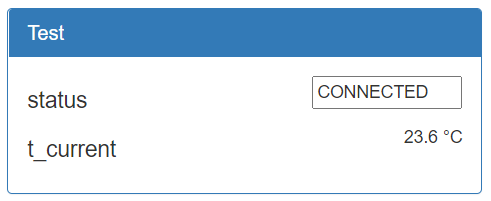

Service allows to set mqtt proxy from wirenboard rule script

##  Install

Please connect your device to the internet

Install NodeJS, if it is not yet
```
curl -sL https://deb.nodesource.com/setup_12.x | bash -
apt-get install -y nodejs git make g++ gcc build-essential
```

Install this packet to global space
```
npm i -g wirenboard-mqtt-proxy
```

Start the service
```
wirenboard-mqtt-proxy start
```

To enable autorun on boot use it
```
wirenboard-mqtt-proxy enable
```

After that you will see mqtt proxy device inside wirenboard UI


Cool! Now we can use proxy from wirenboard rules. Lets start from simple script, where we will get current temperature from ebus daemon using topic `ebusd/370/DisplayedRoomTemp`

Due to `connect` value we can detect when service started after device reboot, so since proxy started lets add necessary topic. Best way to do it - using JSON format task
```
{
  "task": "add",
  "from": "ebusd/370/DisplayedRoomTemp",
  "to": "/devices/test/controls/t_current"
}
```

Result rule: test.js
```javascript
//  created virtual device called "Test"  //
defineVirtualDevice("test", {
  title: "Test",
  cells: {
    t_current: 	{ type: "temperature", 	value: 0 },
    status: 	{ type: "text", 	value: "NOT CONNECTED", forceDefault: true},
  }
});

//  check proxy started  //
setInterval(function(){
  //  wait service started  //
  if (dev["mqtt-proxy"]["connected"] !== 1) return;

  //  set topics  //
  if (dev["test"]["status"] !== "CONNECTED") {
    dev["test"]["status"] = "CONNECTED";
    log("Test: Connected to proxy");

    dev["mqtt-proxy"]["config"] = '{ "task": "add", "from": "ebusd/370/DisplayedRoomTemp", "to": "/devices/test/controls/t_current" }';
  }
}, 1000);
```

When proxy will be connected, test device will set config and will receive temperature data



## Available commands

- `wirenboard-mqtt-proxy enable`  - Enable autorun on boot OS
- `wirenboard-mqtt-proxy disable` - Disable autorun on boot OS
- `wirenboard-mqtt-proxy start`   - Start mqtt proxy
- `wirenboard-mqtt-proxy stop`    - Stop mqtt proxy
- `wirenboard-mqtt-proxy restart` - Restart mqtt proxy

All commands using systemctl, so you can also do this
- `systemctl status wirenboard-mqtt-proxy` - Show service status
- `journalctl -u wirenboard-mqtt-proxy -f` - Show logs

## Notice

wirenboard-mqtt-proxy command using systemctl to enable autorun on boot OS, so service file `wirenboard-mqtt-proxy` copied to `/etc/systemd/system` folder, when you using enable, start, restart command

If you need to edit some files - you can find them at npm global space. This command will help you to locate it
```
npm root -g
```

----

Best regards
- **FullHouse team**
- https://fullhouse-online.ru
- support@fullhouse-online.ru
